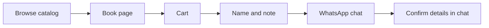
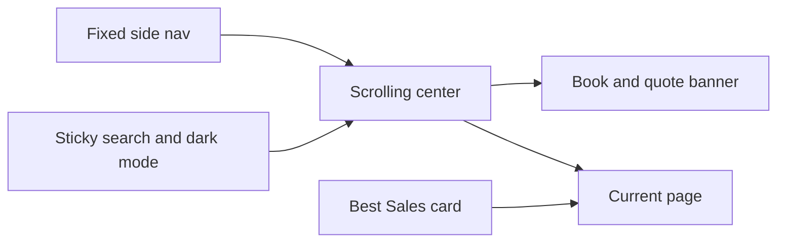

# The Book Coast storefront

A small bookstore website. Visitors learn about the shop, browse books, add them to a cart, and send the order as a WhatsApp message. The shop confirms details and payment in that chat. No accounts, no admin panel, and no card checkout in this version.

The project starts empty. Brand name: **The Book Coast**. The owner edits the catalog, quotes, and sales counts in data files. There is no separate dashboard login.

The sample page is a layout reference only. Use its structure: a side nav that stays put, a center that scrolls, a top search, a dark-mode icon, a banner, and a Best Sales card. Do not copy its book grid, greeting, Live badge, notifications, profile, achievement card, or extra menu items.

Product requirements live in [SPEC.md](SPEC.md). Follow that file when behavior and this plan disagree on a detail.

## What a visitor can do

- Read what the store is (story and how ordering works). The shop has no physical address yet.
- Browse books as a simple list, search by title or author, and filter by Fiction or Non-fiction.
- Under Non-fiction, narrow further to Self-Development or Financial Literacy.
- Open **In Stock** for books that can be ordered, and **Out of Stock** for books that cannot.
- Open a book page with a back arrow, cover, price, and description. In-stock books can be added to the cart. Out-of-stock books stay visible and cannot be added.
- Review the cart, change quantities, and remove items.
- Read a short thank-you, enter a name and an address, choose home delivery or not, add an optional note, then send the order on WhatsApp. The shop chat opens with the order already in the message. Home delivery may cost extra fees.

Books live in a data file in the project, so adding a title means editing that file. A staff admin screen can come later.

## Order flow

The order opens in the WhatsApp message box on the shop number: a short thank-you, then the name, the address on its own line, home delivery as Yes or No, each book with its title, quantity, and price, the total, and the note. The phone number and currency live in one config file so they are easy to change.

Payment is a later step on the same path: after the cart, a future checkout can either open WhatsApp (as now) or take payment. This version only builds the WhatsApp branch. Prices are shown so the customer sees a total, and the chat is where the final amount is agreed.

## Pages

- **Home** — the rotating banner, a short "how to order" note (cart, then WhatsApp), and the Best Sales card.
- **Shop** — full catalog. Each book is labeled In Stock or Out of Stock, and the same filters sit above the list.
- **In Stock** — only books that can be added to the cart.
- **Out of Stock** — only books that are unavailable. They can be opened and read about, and the add-to-cart button stays off.
- **Book** — one title. Reached from Shop, In Stock, Out of Stock, search results, or featured books, not as its own nav item.
- **Cart** — line items, quantities, total, a short thank-you, name, address, a home-delivery choice, note, and "Send order on WhatsApp". The address and note boxes do not resize, and clicking them to type does not add an outline.
- **About** — the store's story.
- **Visit** — physical address coming soon, email, and social links with icons: Facebook, Instagram, TikTok, WhatsApp, and Twitter. No street address, hours, or map.

## Layout

- **Side nav, fixed.** It does not scroll with the page. On a phone it folds behind a menu button. Visit is not in the nav. Best Sales is, in Visit's old place. On a medium or large screen the cart sits at the bottom of the nav. On a phone, dark mode sits at the bottom of the menu.
- **Center, scrolling.** The banner and the current page move. Books are 5 rows. Sliding moves only the row under the pointer, and that row loops so more books keep coming. A phone shows two books in each row. Each cover sits on a colored panel, with the title, a short description, and a save heart underneath, plus price and stock. Add to cart appears when a pointer hovers the card. On a touch screen the button stays visible. Out-of-stock cards show a disabled button. A Visit footer follows every page.
- **Top strip, sticky.** Search appears only on Shop, In Stock, and Out of Stock. On a phone the cart icon is in this strip. On a medium or large screen the dark-mode icon is here. No Live badge, no notification bell, and no profile.
- **Browsing area.** Home, Shop, In Stock, and Out of Stock fill the scrolling center from edge to edge. Quantity changes, remove, and Clear all are on the cart page.

## Side nav

Top to bottom:

- **The Book Coast** — the store name, linking to Home.
- **Shop** — the full catalog.
- **In Stock** — books available to order.
- **Out of Stock** — books that are unavailable.
- **About** — the store's story.
- **Best Sales** — a button in the place Visit used to occupy. The ranked list opens only when that button is clicked.
- **Cart** — on a medium or large screen, a cart icon and the item count. The count is hidden when the cart is empty. On a phone the cart icon is in the top strip. The cart page heading uses the same icon.
- **Dark mode** — on a phone, at the bottom of the menu.

**In Stock** and **Out of Stock** are the labels for available and unavailable. They are two lists of the same catalog, split by a stock flag on each book.

## Banner, dark mode, and Best Sales

The banner sits where the sample says hello. It changes on its own every 15 seconds through the quote list, with no previous, pause, or next controls. Each frame shows a real line from a book, the author, and the book title. If that book is in the catalog, the frame also shows its cover and a link. The owner adds, removes, or edits those lines in the quote file.

The dark-mode control is a crescent moon in light mode and a sun in dark mode. It switches the whole site and remembers the choice in the browser.

**Best Sales** is a button in the side nav. The books stay hidden until it is clicked, then the list shows the titles with the highest `unitsSold`. Scrolling that open list moves only the books. Clicking the button again closes the list. When a sale is registered, that number is raised on the book in the catalog file, and the list reorders itself. If nothing has sold yet, the open list says no sales are recorded. Each row links to the book. It does not show ratings, an Order button row like the sample, or an achievement card.

## Search and filters

**Search** sits in the sticky top strip only on Shop, In Stock, and Out of Stock. It looks at title and author. Submitting it opens Shop with only the matches. Clearing it returns the full catalog. It is hidden on Home, a single book, Cart, About, and Visit. Clicking the field or the Search button does not add an extra outline.

**Filters** sit on Shop, In Stock, and Out of Stock, above the books:

- **Fiction**
- **Non-fiction**
  - **Self-Development**
  - **Financial Literacy**

Choosing Non-fiction shows every non-fiction title, with **All** selected, and reveals Self-Development and Financial Literacy beneath it. Those lists slide the same way as All, including on a phone. Fiction has no sub-filters. An **All** option on the main row clears the filter and shows every book in that list.

## Suggested build

Use **Vite, React, and TypeScript**, with styling in Tailwind. Pages are client-side routes with **React Router**. No database and no server account system for v1.

Routes:

- `/` Home
- `/shop` Shop
- `/in-stock` In Stock
- `/out-of-stock` Out of Stock
- `/books/:id` Book
- `/cart` Cart
- `/about` About
- `/visit` Visit

Data files:

- [`src/data/books.ts`](src/data/books.ts) — catalog: id, title, author, price, cover image path, short description, `inStock`, `featured`, `unitsSold`, `category` (`fiction` or `nonfiction`), and `topic` (`self-development`, `financial-literacy`, or none). Topic is only set on non-fiction books. The banner walks the quote list and shows a cover when a quote's book title matches a catalog title. `unitsSold` starts at 0 and is the number edited when a sale is registered.
- [`src/data/quotes.ts`](src/data/quotes.ts) — the lines the banner rotates. Each one has the quote, the author, and the book it comes from.
- [`src/data/store.ts`](src/data/store.ts) — shop name, WhatsApp number (country code, digits only), currency, email, social profile links, the “physical address coming soon” line, and about copy. No street address or opening hours.
- Cart state in the browser (`localStorage`) so a refresh does not empty the cart.
- Covers in `public/covers/`. Until real photos exist, use simple placeholders.

A cart item stores book id and quantity. Price is always read from the catalog when rendering and when building the WhatsApp message, so a price change in the data file shows up immediately.

## Build order

1. Scaffold a Vite + React + TypeScript + Tailwind app, with React Router for pages.
2. Add store config, quotes, and a starter catalog with stock, category, and units sold.
3. Build a fixed side nav, sticky search and dark-mode bar, scrolling center, and Best Sales card.
4. Build Home, Shop, In Stock, Out of Stock, Book, About, and Visit pages. Books are a grid with the description under each card, not the sample dashboard grid.
5. Replace the greeting banner with a rotator of quotes. Show a cover when the quote's book is in the catalog.
6. Search by title and author, and filter Fiction / Non-fiction, with Self-Development and Financial Literacy under Non-fiction.
7. Add cart state (`localStorage`), quantity edits, and totals.
8. Build the order form and WhatsApp message link from the cart.

## Left for later

- Card or mobile-money checkout.
- Customer accounts and order history.
- An admin screen to add books without editing code.
- Exact copy counts (v1 only marks a book in stock or out of stock).
